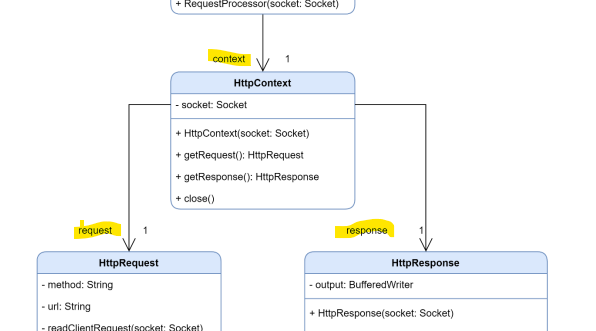

<p style="text-align: center;font-weight:bold; font-size:20px;">Compte-rendu du TP2 de Java</p>
<p style="text-align: center;">Quentin DAVIN</p>
<p style="text-align: center;font-style:italic; font-size:14px;">10/04/2024</p>
<br>
<br>
<br>
<br>
<br>
<br>
<br>
<br>
<br>
<br>
<br>
<br>
<br>
<br> 
<br>
<br>
<br>
<br>
<br>
<br>
<br>
<br> 
<br>
<br>
<br>
<br>
<br>
<br>
<br>
<br>
<br>
<br>
<br>
<br>
<br>
<br>

## Partie Ce n'est pas une chausette

Je n'ai pas eu de difficulté sur cette partie.

## Partie Réorganisation

Ma seule difficulté sur cette partie est sur la lecture du schéma de l'UML :



Je ne savais pas que les éléments surlignés en jaune sur l'image ci-dessus sont des variables de la classe d'où part la flèche.

## Partie A la mano 

Je n'ai pas eu de difficulté à part sur une légère sur la taille du Content (que c'est juste la fonction `length()` de la classe String);

## Partie Avec des fichiers 

Là, j'ai dù chercher comme faire une liste de `bytes` en Java.
Car dans le CM de M.Meunier, on lit un fichier et on l'écrit directement sans mettre dans une variable.
Pour cela j'ai découvert (sur StackOverflow) la classe `ByteArrayOutputStream`, ce qui a donné la fonction `sendFile` suivante :

````java
import java.io.IOException;

public void sendFile(String contentText, String fileName) {
    try {
        File file = new File("/workspaces/tp-java/tp-2", fileName);
        if (!file.exists()) {
            this.notFound("File not Found");
            return;
        }

        FileInputStream inputStream = new FileInputStream(file);
        ByteArrayOutputStream outputStream = new ByteArrayOutputStream();

        byte[] buffer = new byte[4096];
        int bytesRead = 0;

        do {
            bytesRead = inputStream.read(buffer);
            outputStream.write(buffer, 0, bytesRead);
        } while (bytesRead == 4096);
        inputStream.close();

        this.output.write("HTTP/1.0 200\n".getBytes(StandardCharsets.UTF_8));
        this.output.write(("Content-Type: " + contentType + "\n").getBytes(StandardCharsets.UTF_8));
        this.output.write(("Content-Length: " + outputStream.size() + "\n").getBytes(StandardCharsets.UTF_8));
        this.output.write("\n".getBytes(StandardCharsets.UTF_8));
        this.output.write(outputStream.toByteArray());
        outputStream.close();
        this.output.flush();
    } catch (IOException e){
        e.printStackTrace();
    }
}
````
Et aussi l'utilsation de ``getBytes(StandardCharsets.UTF_8)`` car sinon, j'ai eu des problèmes d'encodages avec le HTML.

## Partie La fin de "chacun son tour"

J'ai eu aucune difficulté apparante.

# Code 

Vous pouvez retrouver mes codes sur ce dépot [GitHub](https://github.com/itsax404/tp-java)